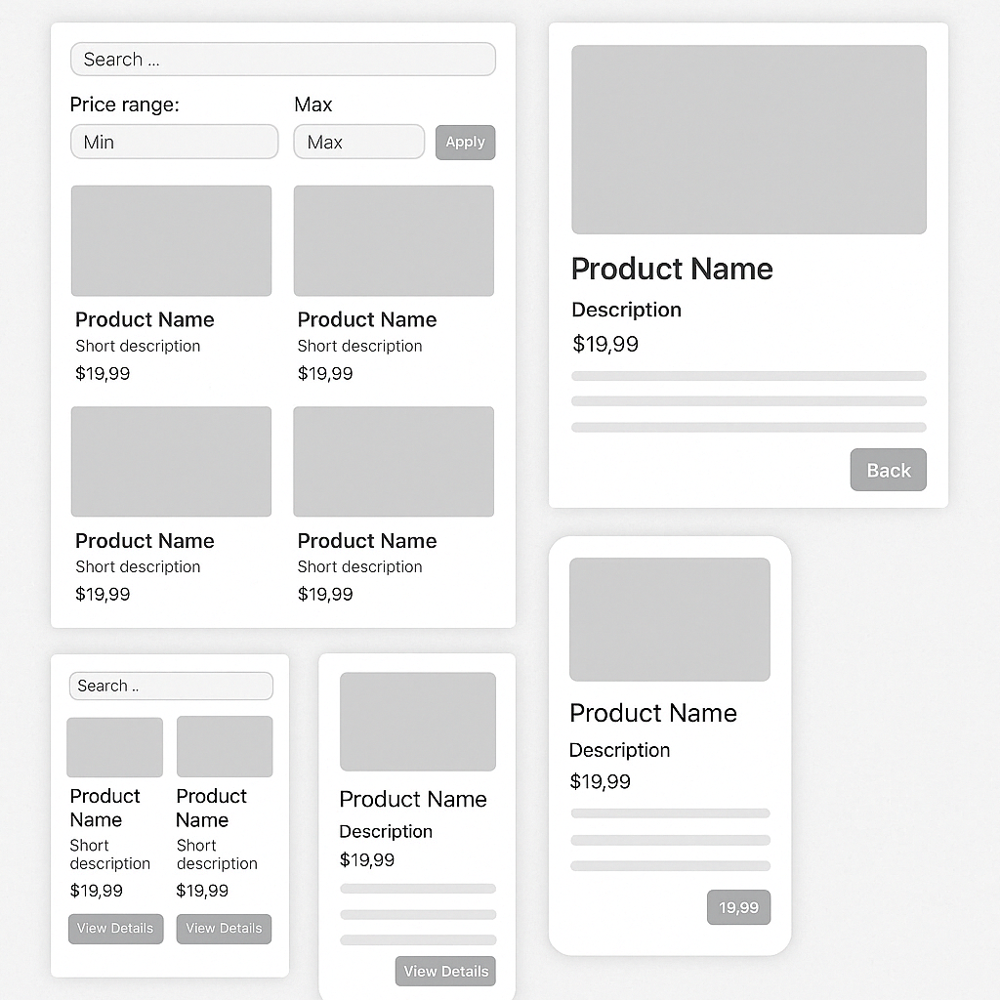

# 🧪 Тестовое задание: Каталог товаров

## 📍 Цель
Создать одностраничное приложение (SPA) на Vue 3 + TypeScript для отображения каталога товаров и детальной информации о каждом товаре, а также добавить страницу о пользователях и отдельном пользователе. 

API https://fakestoreapi.com/

---

## 🛠️ Стек технологий

- Vue 3 + Composition API
- TypeScript (обязательно)
- SCSS с BEM-неймингом
- Vue Router
- Vite

---

## 🔧 Функциональность

### Главная страница (`/`)
- Список товаров (название, краткое описание, цена, кнопка "Подробнее")
- Поиск по названию
- Фильтрация по цене (от/до)
- Адаптивная вёрстка
- Загрузка и отображение состояния "Загрузка..." или скелетон
- Отображение состояния "Ничего не найдено" (empty state)

### Страница товара (`/product/:id`)
- Полное описание, цена, изображение
- Кнопка "Назад" на главную
- Обработка случая, если товар не найден

### Страница пользователей (`/users`)
- Список пользователей в таблице
- Поиск пользователя
- Фильтрация по любому из параметров
- Адаптивная вёрстка
- Загрузка и отображение состояния "Загрузка..." или скелетон
- Отображение состояния "Ничего не найдено" (empty state)

### Страница товара (`/users/:id`)
- Полное описание пользователя
- Кнопка "Назад" на главную
- Обработка случая, если пользователь не найден

---

## 📁 Структура проекта

- `src/components` — переиспользуемые компоненты
- `src/views` — страницы
- `src/api` — работа с API и типы
- `src/styles` — общие стили

---

## 🎨 Макет



---

## 📦 Установка и запуск

```bash
# Установите зависимости
npm install

# Запустите проект
npm run dev
```

---

## 🧪 Оценка

| Критерий       | Описание |
|----------------|----------|
| TypeScript     | Типизация props, emits, API |
| Vue 3          | Composition API, маршруты |
| SCSS + BEM     | Чистота стилей |
| UI             | Макет, адаптивность |
| Архитектура    | Переиспользуемость компонентов |
| Чистота кода   | Структура, именование, логика |
| UX             | Лоадер, empty state, обработка ошибок |

---

## 💡 Бонус (по желанию)

- Добавление тёмной темы
- Использование Git + осмысленные коммиты
- Адаптация под мобильные устройства

---

## ⏳ Срок выполнения
1 неделя
